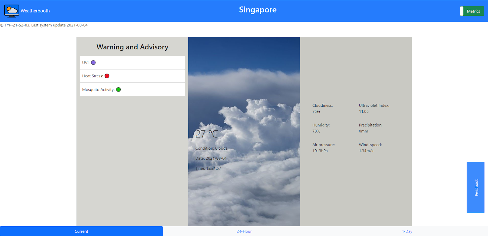
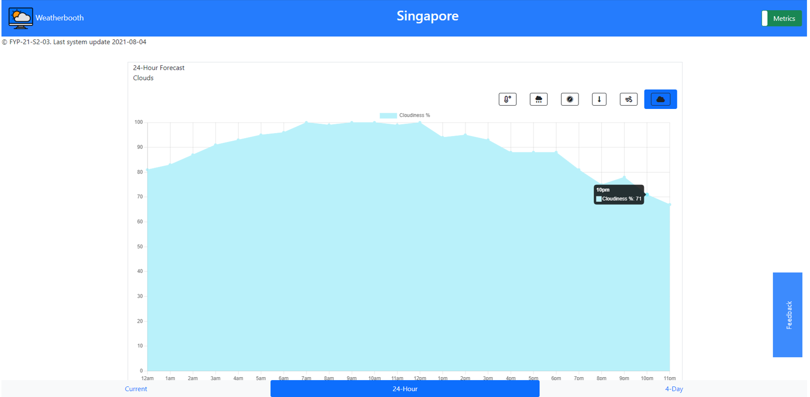
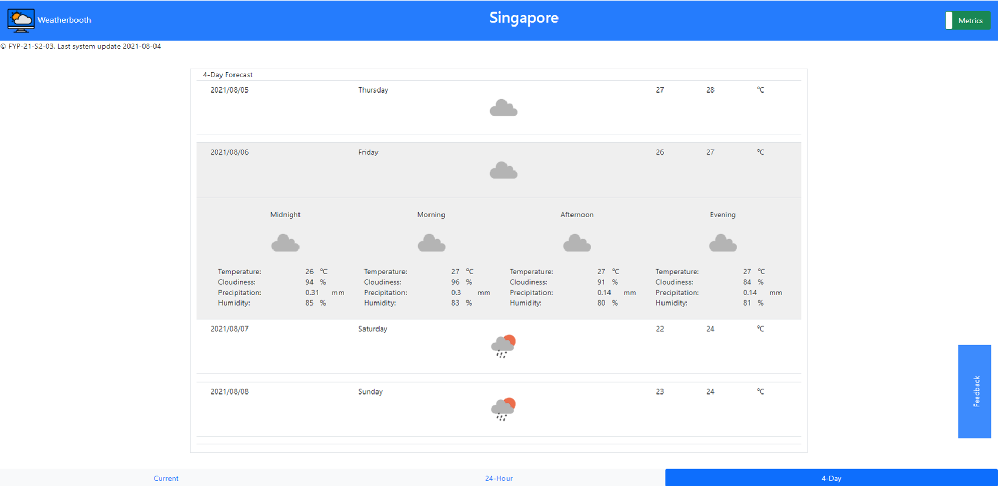

  </img>

<h1 align="center"> Weatherbooth </h1>

  
  
  <a href="https://github.com/boher/Weatherbooth/actions?query=workflow%3A'python-package'">
    
  

  
A web-application that aims to keep the general public in Singapore well-informed and well-prepared with accurate weather forecasts

Based on weather models trained by machine learning algorithms, namely:
  
- Long Short-Term Memory (LSTM) for time series analysis

- Decision Tree for classification

 
  
Data obtained from various historical weather APIs are normalized with Min/Max Scalar before processing

## Screenshots
| Current Weather Observations          | Hourly Weather Predictions (24 Hour)  | Daily Weather Predictions (4 days)      |
|---------------------------------------|---------------------------------------|-----------------------------------------|
|        |         |            |

## Running your own instance locally
### Assumptions: 
- Open source and personal use only
- Python3 has been installed and added to the PATH environment variables
- macOS 10.15 and above or Windows 10 and above

### Steps to perform:
Step-1: Clone the repository (main branch)
 
 
Step-2: Open the terminal or command-line prompt
 
 
Step-3: Copy the local file path of the cloned repository
 
 
Step-4: Navigate to the directory containing the cloned repository with the command `cd <file-path-copied>`
 
 
Step-5: Install the required python dependencies for this project by running the command `pip install -r requirements.txt`
 
 
Step-7: Navigate to the subdirectory folder (./Weatherbooth/website) and open config.py in a text editor
 
 
Step-8: Comment out line 5 and uncomment line 10 in config.py and save the file
 
 
Step-9: Execute the app by running the command `python app.py` in the terminal or command-line and click on the link provided `http://localhost:5000/`

## Directory Markdown

## Licensing
Licensed under [GNU Affero General Public License v3](LICENSE)

The current version of Weatherbooth is hosted at https://weatherbooth.herokuapp.com

Any reproductions of this webapp hosted publicly must be open source, generate your own unique key for DB creation and include a explicit link crediting the developers of Weatherbooth.

## Special thanks

### Development tools and modules used:
[Flask](https://flask.palletsprojects.com/en/2.0.x/ "Flask Documentation") as our backend (Deployed version and REST API version)
 
[Bootstrap](https://getbootstrap.com/docs/5.0/getting-started/introduction/) as our CSS framework
 
[Chart.js](https://www.chartjs.org/docs/latest/) for visualizing hourly weather predictions
 
[React](https://github.com/facebook/react/blob/main/README.md) supported with [API requests](https://axios-http.com/docs/intro), [route navigation](https://reactrouter.com/web/guides), wrappers for [Bootstrap](https://react-bootstrap.github.io/getting-started/introduction/) and [Chart.js](https://github.com/chartjs/Chart.js/releases) dependencies as our frontend (REST API version)
 
[Tensorflow](https://www.tensorflow.org/guide/keras/rnn) for modeling data pipelines of target weather attributes, to predict hourly and daily values for the next few days
 
[Scikit](https://scikit-learn.org/stable/auto_examples/preprocessing/plot_all_scaling.html#minmaxscaler)[-learn](https://scikit-learn.org/stable/modules/tree.html) for preprocessing data and classification of weather conditions
 
[Heroku](https://devcenter.heroku.com/categories/reference "Heroku Documentation") for easy CI/CD with GitHub and Student Developer Pack
 
### Open source weather APIs:
[OpenWeatherMap](https://openweathermap.org/api) for their generous offers of various weather data APIs for free-tier users
 
[Oikolab](https://docs.oikolab.com/) for providing processed global historical climate reanalysis weather data via REST API
 
[PirateWeather](https://pirateweather.net/) for providing processed satellite historical weather data via REST API
 
